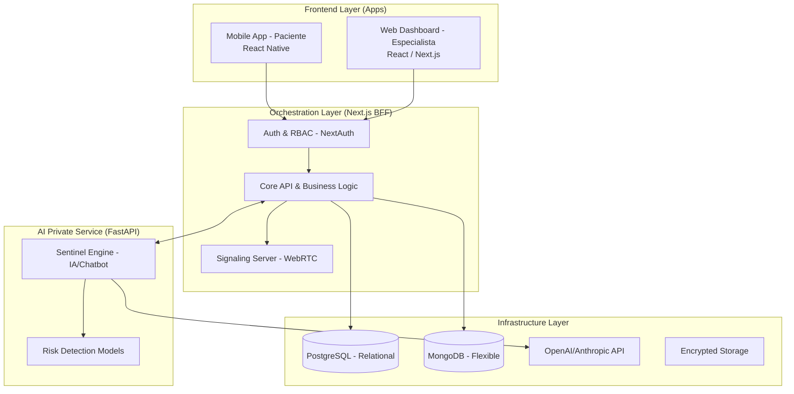

# Marcheli: Arquitectura de Referencia

**Fecha:** 2026-04-20
**Estado:** Propuesta Final / Guía Técnica
**Etiquetas:** #arquitectura, #clean-architecture, #bff, #orchestrator, #fastapi, #react-native

## Resumen Arquitectónico
Marcheli se construye bajo un patrón de **Orquestador Central (BFF - Backend For Frontend)** usando **Next.js**. Esta estructura centraliza la seguridad, la persistencia y la lógica de negocio, delegando tareas pesadas de IA a un microservicio privado en **FastAPI**.

---

## 1. Diagrama de Sistema (Patrón Orquestador)

---

## 2. Tecnologías y Roles

### A. Frontend (Apps)
*   **Web (Especialista):** Construido en **React (Next.js)** para una gestión clínica robusta y SEO optimizado.
*   **Mobile (Paciente):** Construido en **React Native** para maximizar la reutilización de lógica y tipos con la web, centrado en el Chatbot y Telemedicina.

### B. Orquestador (Next.js)
Actúa como el único punto de entrada para las apps.
*   **Seguridad:** Gestiona la autenticación centralizada (NextAuth) y los roles (RBAC).
*   **Signaling:** Servidor de señales para **WebRTC** (Video-consultas).
*   **Persistencia:** Es el único componente que interactúa con **Prisma (Postgres)** y **Mongoose (MongoDB)**.

### C. IA Service (FastAPI)
Microservicio privado de alto rendimiento.
*   **Chatbot:** Procesa los mensajes del paciente usando modelos de Python.
*   **Privacidad:** Solo es accesible por el Orquestador (Next.js), protegiendo la lógica de IA del acceso público.

---

## 3. Estrategia de Datos Híbrida
*   **PostgreSQL:** Datos estructurales, historial clínico, citas y gestión de usuarios.
*   **MongoDB:** Constructor de cuestionarios y almacenamiento de logs del Chatbot de IA.

## 4. Comunicación y Tiempo Real
*   **WebRTC:** Telemedicina integrada entre React Native (Paciente) y React (Especialista).
*   **WebSockets:** Alertas instantáneas de riesgo enviadas desde el Orquestador al Dashboard del especialista cuando el `Sentinel Engine` detecta una anomalía.

---

@idea: Mantener el **Monorepo** para el Orquestador y las Apps Web/Mobile para compartir tipos de datos, mientras que el servicio de **FastAPI** puede vivir como un módulo independiente o contenedor separado.
