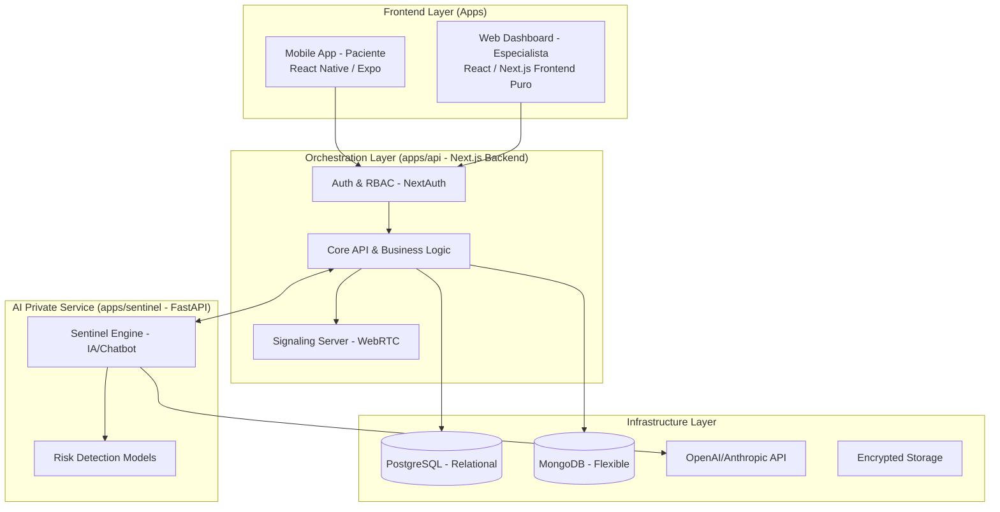

# Marcheli: Arquitectura de Referencia

**Fecha:** 2026-04-20
**Estado:** Propuesta Final / Guía Técnica
**Etiquetas:** #arquitectura, #clean-architecture, #bff, #orchestrator, #fastapi, #react-native

## Resumen Arquitectónico
Marcheli se construye bajo un patrón de **Orquestador Central (BFF - Backend For Frontend)**. A diferencia del diseño original, la API backend está desacoplada del frontend web, resultando en cuatro aplicaciones principales: un frontend web (Next.js), una app móvil (Expo), el API Orquestador (Next.js) que centraliza la seguridad y persistencia, y un microservicio privado de IA en **FastAPI**.

---

## 1. Diagrama de Sistema (Patrón Orquestador)

---

## 2. Tecnologías y Roles

### A. Frontend Web (`apps/web`)
*   **Rol:** Web Dashboard (Especialista) para la gestión clínica robusta y SEO optimizado. Construido en **Next.js (React)** actuando como cliente puro que consume a `apps/api`.
*   **Patrón de Diseño:** **Feature-Sliced Design (FSD)** o Diseño Modular.
    *   La estructura (`src/features/...`) agrupa componentes, hooks y estado por dominio de negocio (ej. `pacientes`, `citas`) en lugar de tipo de archivo, garantizando la escalabilidad de la UI.

### B. Frontend Mobile (`apps/mobile`)
*   **Rol:** Mobile App (Paciente) centrada en el Chatbot y Telemedicina. Construido con **React Native y Expo**.
*   **Patrón de Diseño:** **Model-View-ViewModel (MVVM)** adaptado a React.
    *   **Model:** Interfaces y gestión de caché (React Query).
    *   **View:** Componentes presentacionales sin lógica compleja.
    *   **ViewModel:** Hooks personalizados que consumen el Orquestador (`apps/api`), manteniendo la app móvil muy ligera y delegando carga a la nube.

### C. Orquestador y Core API (`apps/api`)
*   **Rol:** Backend For Frontend (BFF) construido como una aplicación **Next.js puramente API**. Es el único punto de entrada para las bases de datos y la seguridad (NextAuth).
*   **Patrón de Diseño:** **Controller-Service-Repository**.
    *   **Controllers:** API Routes que reciben peticiones HTTP.
    *   **Services:** Lógica de negocio (orquestación, autorizaciones).
    *   **Repository:** Capa de acceso a datos que interactúa con Prisma/MongoDB (importado de `packages/database`).

### D. IA Service / Sentinel (`apps/sentinel`)
*   **Rol:** Microservicio privado de alto rendimiento construido en **Python (FastAPI)**. Maneja modelos NLP y lógica del chatbot. Solo accesible desde `apps/api`.
*   **Patrón de Diseño:** **Arquitectura Hexagonal (Ports & Adapters) / Clean Architecture**.
    *   La lógica dura de IA se aísla en el Core Domain.
    *   Los endpoints de FastAPI actúan como puertos/adaptadores.
    *   Garantiza testabilidad y separación total de la capa HTTP de los modelos de riesgo.

---

## 3. Estrategia de Datos Híbrida
*   **PostgreSQL:** Datos estructurales, historial clínico, citas y gestión de usuarios.
*   **MongoDB:** Constructor de cuestionarios y almacenamiento de logs del Chatbot de IA.

## 4. Comunicación y Tiempo Real
*   **WebRTC:** Telemedicina integrada entre React Native (Paciente) y React (Especialista).
*   **WebSockets:** Alertas instantáneas de riesgo enviadas desde el Orquestador al Dashboard del especialista cuando el `Sentinel Engine` detecta una anomalía.

---

@idea: La estructura física del monorepo se refleja en `apps/` con cuatro componentes principales (`web`, `mobile`, `api`, `sentinel`), mientras que los esquemas de bases de datos compartidos residen en `packages/database`.
