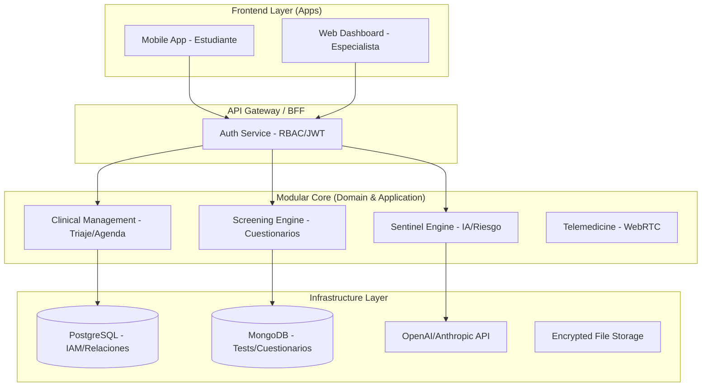

# Marcheli: Arquitectura de Referencia

**Fecha:** 2026-04-19
**Estado:** Propuesta / Guía Técnica
**Etiquetas:** #arquitectura, #clean-architecture, #ddd, #monorepo

## Resumen Arquitectónico
Marcheli se construirá bajo un enfoque de **Monolito Modular** siguiendo los principios de **Clean Architecture** y **Domain-Driven Design (DDD)**. Esta estructura garantiza que la lógica clínica (el dominio) sea el centro del sistema, aislada de las bases de datos y las interfaces de usuario.

---

## 1. Diagrama de Sistema

---

## 2. Capas de la Aplicación (Clean Architecture)

### A. Domain Layer (Núcleo)
Contiene las entidades de negocio (Paciente, Especialista, Cuestionario, Alerta) y las reglas clínicas inmutables. No depende de ninguna librería externa.

### B. Application Layer (Casos de Uso)
Define qué hace la aplicación. Ejemplo: `ProcesarRespuestaCuestionario`, `DetectarRiesgoEnChat`, `AgendarCitaEmergencia`. Coordina la ejecución de las reglas de dominio.

### C. Infrastructure Layer (Implementación)
Detalles técnicos:
*   **Persistencia:** Implementaciones de repositorios para PostgreSQL y MongoDB.
*   **Servicios Externos:** Adaptadores para APIs de IA, servicios de Videollamada y Notificaciones Push.
*   **Seguridad:** Módulos de cifrado AES-256.

---

## 3. Estrategia de Datos Híbrida
*   **PostgreSQL:** Datos estructurados y relacionales. Garantiza integridad referencial para la gestión de usuarios y roles (RBAC).
*   **MongoDB:** Datos semi-estructurados. Ideal para el constructor de cuestionarios dinámicos donde las preguntas y respuestas pueden variar de esquema sin previo aviso.

## 4. Comunicación por Eventos
El sistema utilizará un patrón de **Eventos de Dominio** para la detección proactiva.
*   *Evento:* `RiskDetectedEvent`
*   *Acción:* El Dashboard del especialista se actualiza por WebSockets y se envía una notificación push al móvil del especialista asignado.

@idea: Usar **Prisma** como ORM para PostgreSQL para mantener la seguridad de tipos (Type-Safety) y **Mongoose** para MongoDB para el modelado de esquemas flexibles.
